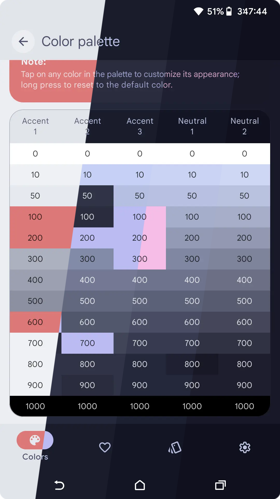
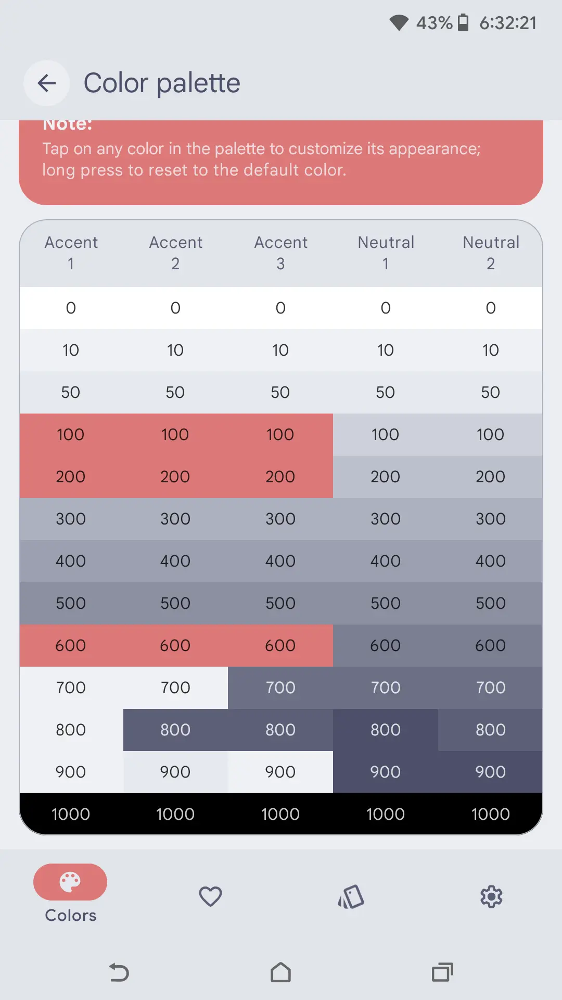
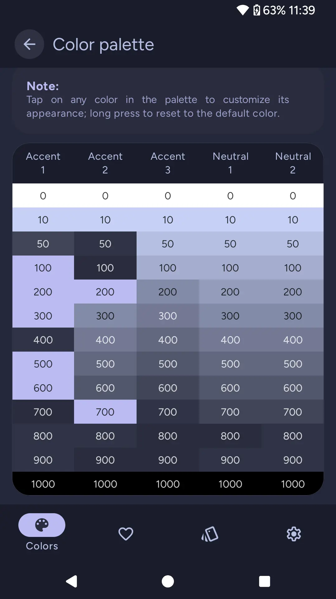
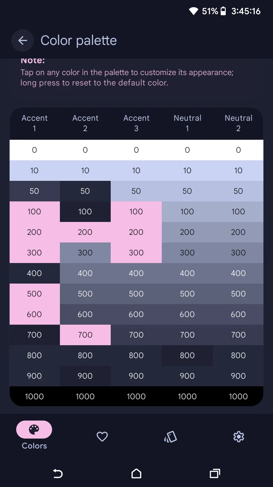
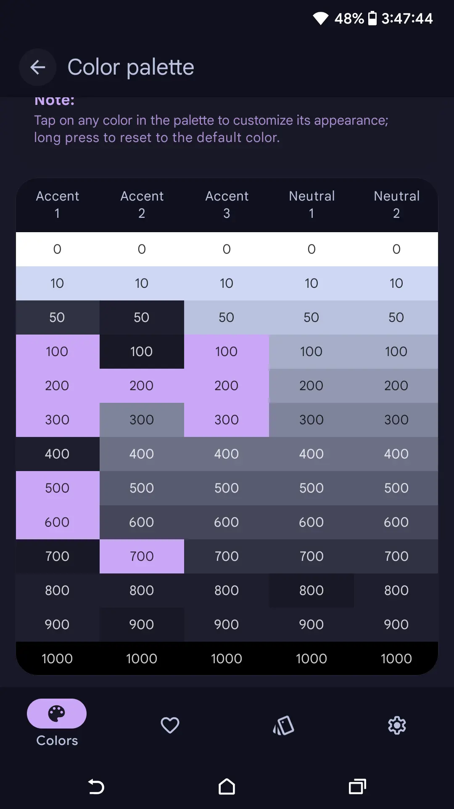

<h3 align="center">
	 
	
	Catppuccin for <a href="https://github.com/Mahmud0808/ColorBlendr">ColorBlendr</a>
	
</h3>

	
	
	

	

## Previews

🌻 Latte

🪴 Frappé

🌺 Macchiato

🌿 Mocha

## Usage

1. Download your preferred flavor(s) from [themes/](https://github.com/catppuccin/colorblendr/tree/main/themes)
2. Set colors to 'Natural' in android display settings
3. Enable 'Dark theme' if you are using a Frappé, Macchiato or Mocha theme and disable it if you are using a Latte theme
4. Restore the downloaded .colorblendr file in colorblendr's settings under Backup & Restore configs

## 🙋 FAQ

- Q: **_"What android roms are compatible?"_**\
  A: All roms that don't change or remove material you color theming are fully compatible, examples of incompatible roms are /e/os and oneui

- Q: **_"Is root required?"_**\
  A: Yes

## 💝 Thanks to

- [Luna-Terra-CG](https://github.com/Luna-Terra-CG)

&nbsp;

	

	Copyright &copy; 2021-present <a href="https://github.com/catppuccin" target="_blank">Catppuccin Org</a>

	

